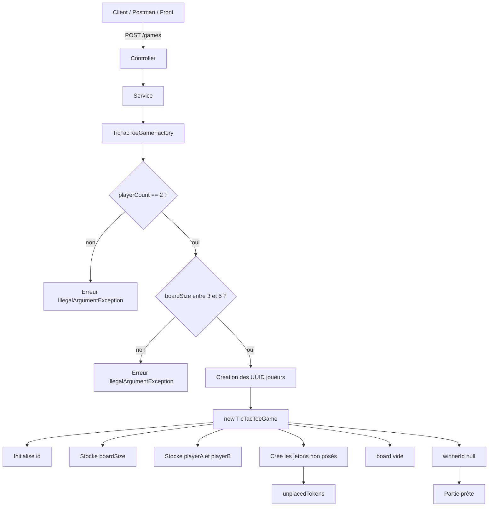

# Fonctionnement de la création d'une partie

```mermaid
flowchart TD
    A[Client / Postman / Front] -->|POST /games| B[Controller]
    B --> C[Service]
    C --> D[TicTacToeGameFactory]

    D --> E{playerCount == 2 ?}
    E -->|non| F[Erreur IllegalArgumentException]
    E -->|oui| G{boardSize entre 3 et 5 ?}

    G -->|non| H[Erreur IllegalArgumentException]
    G -->|oui| I[Création des UUID joueurs]

    I --> J[new TicTacToeGame]
    J --> K[Initialise id]
    J --> L[Stocke boardSize]
    J --> M[Stocke playerA et playerB]
    J --> N[Crée les jetons non posés]

    N --> O[unplacedTokens]
    J --> P[board vide]
    J --> Q[winnerId null]

    Q --> R[Partie prête]
```